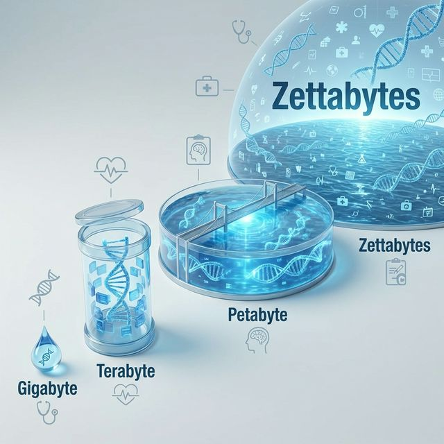
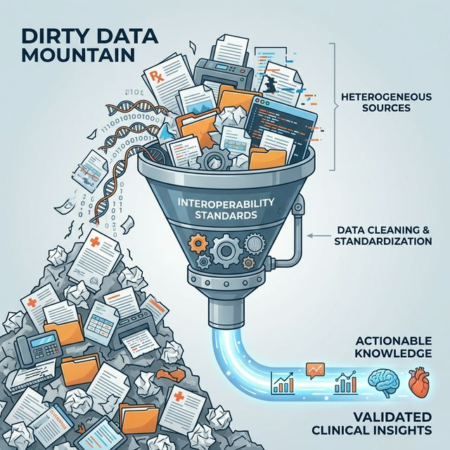
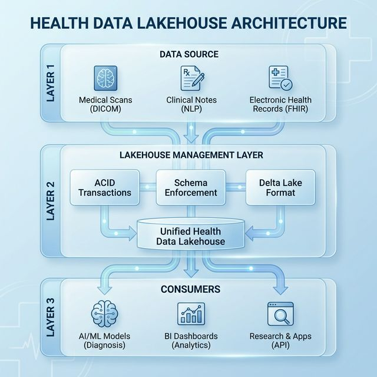
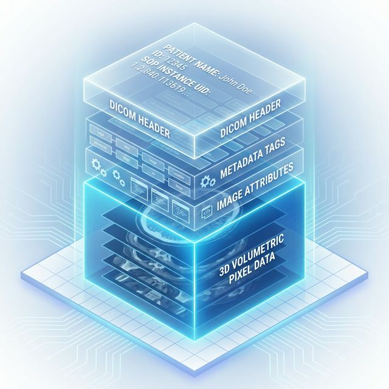
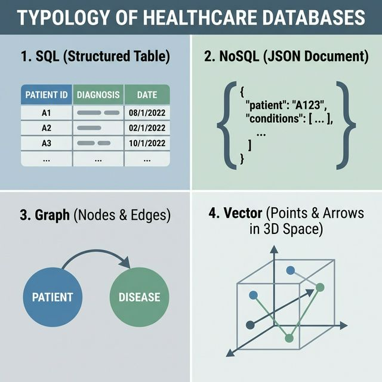
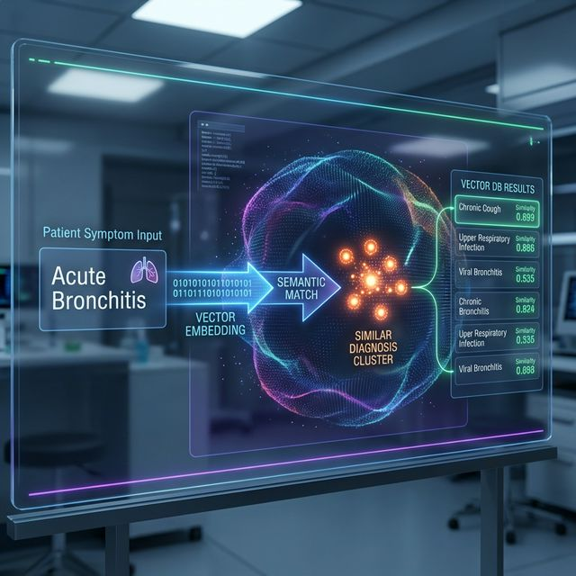
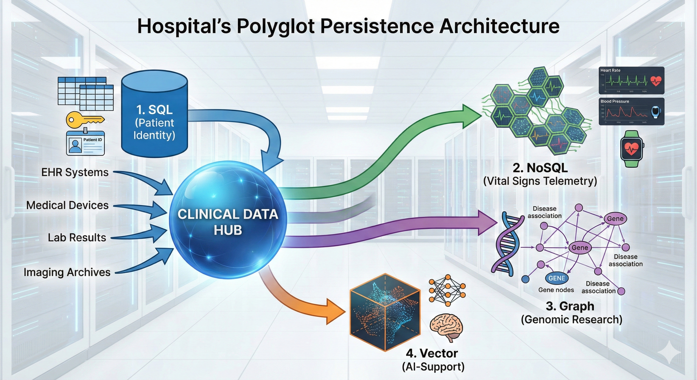
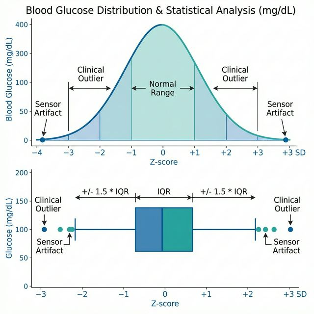
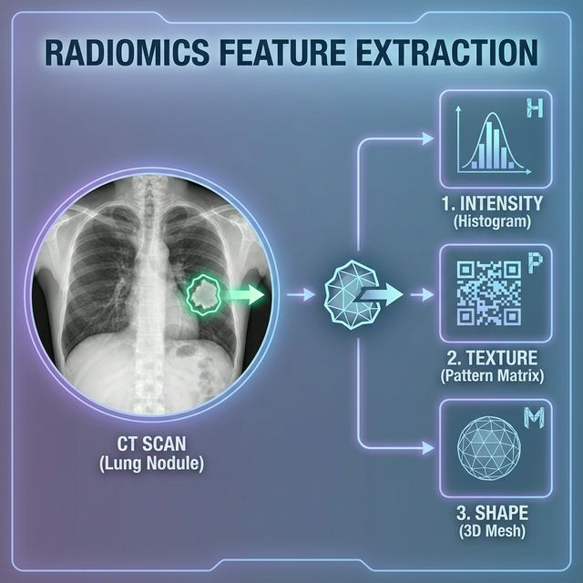
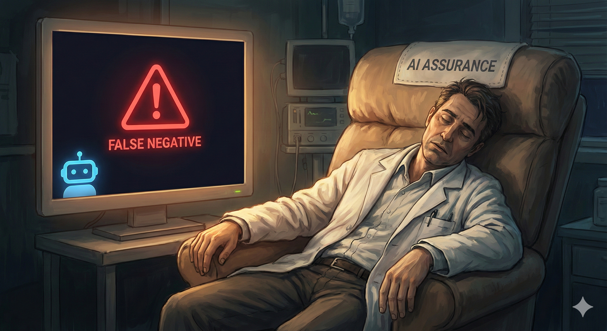

# Módulo 1: El Ecosistema de Datos en Salud {background-color="#0f172a"}

# Introducción {.center}

::: {.r-fit-text}
METAMORFOSIS DIGITAL
:::

::: {.columns}
::: {.column width="60%"}
La industria de la salud está experimentando una transformación sin precedentes, impulsada por una explosión en la generación de datos que redefine la práctica médica, la investigación y la gestión sanitaria.

> Entender este ecosistema no es solo cuestión de tecnología, sino de comprender cómo la información fluye, se almacena y se transforma en valor clínico.
:::

::: {.column width="40%"}
```{mermaid}
%%| fig-align: center
graph TD
    A[Medicina<br/>Artesanal] -->|Digitalización| B(EHR<br/>Silos de Datos)
    B -->|Transformación| C(Ecosistema<br/>Inteligente)
    style C fill:#b3e5fc,stroke:#0288d1,stroke-width:2px
```
:::
:::

::: {.notes}
Estamos viviendo una metamorfosis.
La salud ha pasado de ser una industria artesanal basada en la intuición a una industria industrial basada en datos.
No se trata solo de tener ordenadores; se trata de una redefinición fundamental de lo que significa "diagnosticar" y "tratar".
Hoy, el fonendoscopio más potente es un algoritmo analizando Terabytes de datos.
:::

## Evolución del Volumen de Datos

::: {.columns}
::: {.column width="50%"}

### Crecimiento Exponencial

* **Ritmo Acelerado:** El volumen global de datos aumenta a una [CAGR]{title="Compound Annual Growth Rate - Tasa de Crecimiento Anual Compuesto"} del **36%**, superando al sector financiero [@Exponential2026].
* **Proyección 2025:** Se alcanzarán los **10 Zettabytes**.
    * 1 Zettabyte = 1 billón de Gigabytes.

::: {.callout-note title="Escala Masiva"}
Estamos pasando de la era del Gigabyte a la era del Zettabyte.
:::
:::

::: {.column width="50%"}

:::
:::

::: {.notes}
Para que se hagan una idea de la magnitud:
La salud genera datos más rápido que Wall Street o la industria manufacturera. Crecemos al 36% anual.
En 2025 alcanzaremos los 10 Zettabytes.
Un Zettabyte es un 1 seguido de 21 ceros. Es una cifra astronómica que nuestra infraestructura actual apenas puede gestionar.
:::

## La Obsolescencia del Conocimiento

La velocidad de generación de datos crea un desafío cognitivo imposible para el ser humano.

::: {.r-stack}
::: {.fragment .fade-in-then-out}
### 1950
El conocimiento médico se duplicaba cada **50 años**.
:::

::: {.fragment .fade-in-then-out}
### 2010
El tiempo de duplicación se redujo a **3.5 años**.
:::

::: {.fragment .fade-in}
### 2020
El conocimiento se duplica cada **73 días** [@Harness2026].
:::
:::

::: {.fragment}
> Un estudiante que inicia hoy se enfrentará a un corpus de conocimiento multiplicado varias veces antes de graduarse. El apoyo de la [IA]{title="Inteligencia Artificial"} es indispensable [@Harness2026].
:::

::: {.notes}
Esta es la diapositiva más aterradora para cualquier médico.
En 1950, lo que aprendías en la facultad te servía para toda tu carrera.
Hoy, el conocimiento médico se duplica cada 73 días.
Es humanamente imposible mantenerse al día.
La IA no es un "lujo" tecnológico; es la única herramienta que nos permite sobrevivir a esta avalancha cognitiva. Sin IA, la medicina basada en evidencia es una utopía inalcanzable.
:::

## Motores de la Explosión de Información

Tres factores principales impulsan este crecimiento masivo:

::: {.columns}
::: {.column width="33%"}
### 1. Genómica
La secuenciación de un solo genoma genera hasta **200 GB** de datos crudos. Las iniciativas poblacionales convierten a la genómica en una de las fuentes más voluminosas [@Lukhele2025].
:::

::: {.column width="33%"}
### 2. Imagenología
Transición de radiografías 2D a:
* [CT]{title="Computed Tomography - Tomografía Computarizada"} volumétricas.
* [MRI]{title="Magnetic Resonance Imaging - Imagen por Resonancia Magnética"} funcionales.
* Patología digital (GBs por imagen) [@Hamlomo2025].
:::

::: {.column width="33%"}
### 3. [IoMT]{title="Internet of Medical Things - Internet de las Cosas Médicas"}
Wearables y sensores implantables generan flujos continuos de telemetría (frecuencia cardíaca, glucosa) que requieren ingestión en tiempo real [@Majeed2023].
:::
:::

::: {.notes}
¿De dónde salen todos estos datos?
1.  **Genómica**: Secuenciar a una persona son 200GB. Multiplica eso por millones en estudios poblacionales.
2.  **Imagen**: Ya no hacemos "fotos"; hacemos volúmenes 3D y vídeos 4D. Una biopsia digitalizada tiene gigapíxeles de resolución.
3.  **IoMT**: Tu reloj inteligente, tu marcapasos, tu monitor de glucosa. Envían datos cada segundo, 24/7/365. Es un tsunami de datos en tiempo real.
:::

## El Problema del "Dirty Data"

A pesar de la abundancia, sufrimos el síndrome **[DRIP]{title="Data Rich, Information Poor - Rico en Datos, Pobre en Información"}**.

::: {.columns}
::: {.column width="60%"}
### El Costo del Caos
Los "datos sucios" (incompletos, inexactos o duplicados) cuestan a la industria de EE. UU. más de **$300 mil millones/año** [@Ghiassi2019].

* Nombres mal escritos.
* Historiales fragmentados.
* Riesgos de seguridad del paciente.

::: {.callout-caution title="El Síndrome DRIP"}
Las organizaciones están inundadas de datos, pero carecen de capacidad para extraer insights significativos debido a la mala calidad y la falta de estandarización [@Strategies2026].
:::
:::

::: {.column width="40%"}
{#fig-interoperability-funnel}
:::
:::

::: {.notes}
Paradoja: Nos ahogamos en datos, pero nos morimos de sed de información. (DRIP Syndrome).
Tener 100 PDFs escaneados no sirve de nada a un algoritmo.
El costo de los "Datos Sucios" es real: 300.000 millones de dólares al año solo en EEUU.
Y peor aún: pacientes que reciben el medicamento equivocado porque su alergia estaba en otro sistema con el nombre mal escrito.
:::

## Interoperabilidad: El Lenguaje Común

La solución a los "silos" reside en estándares globales de comunicación.

::: {.panel-tabset}

### [HL7]{title="Health Level Seven"} / [FHIR]{title="Fast Healthcare Interoperability Resources"}
Utiliza tecnologías web modernas ([API]{title="Application Programming Interface"} [RESTful]{title="Representational State Transfer"}, [JSON]{title="JavaScript Object Notation"}) para permitir que sistemas dispares hablen el mismo idioma [@Bodenreider2018].
* *Ejemplo:* Una app de diabetes envía glucosa al registro del hospital [@Ohlsen2024].

### [DICOM]{title="Digital Imaging and Communications in Medicine"}
Estándar universal para manejo, almacenamiento e impresión de imágenes médicas [@Dicom2026].
* Garantiza que una resonancia de un equipo Siemens se vea en una estación GE.

### Vocabularios
Estandarizan el significado clínico:
* **[LOINC]{title="Logical Observation Identifiers Names and Codes"}:** Códigos de laboratorio (ej. Hemoglobina).
* **[SNOMED CT]{title="Systematized Nomenclature of Medicine -- Clinical Terms"}:** Diagnósticos y hallazgos clínicos con estructura ontológica [@Bodenreider2018].

:::

::: {.notes}
Para arreglar el caos, necesitamos un esperanto médico.
**FHIR** es la estrella. Usa la tecnología de Internet (JSON, REST) para conectar hospitales.
**DICOM** es el veterano que logró que todas las máquinas de rayos X se entiendan.
**SNOMED y LOINC** son los diccionarios. Se aseguran de que cuando yo digo "Fiebre", tu ordenador entienda exactamente qué significa, sin ambigüedades de lenguaje natural.
:::

## Lecciones de la IA: Caso IBM Watson

Una advertencia histórica sobre expectativas vs. realidad.

::: {.columns}
::: {.column width="50%"}
### La Promesa Fallida
[IBM]{title="International Business Machines"} Watson for Oncology invirtió **$62 millones** pero no logró integrarse rutinariamente en la clínica [@Billion2026].

::: {.callout-warning title="Caja Negra"}
Los médicos desconfiaban de recomendaciones donde la [IA]{title="Inteligencia Artificial"} no podía explicar su razonamiento [@Watson2026].
:::
:::

::: {.column width="50%"}
### Lecciones Críticas
1.  **Datos No Curados:** Watson falló al procesar notas clínicas no estructuradas y jerga médica real.
2.  **Contexto Local:** Las guías de EE. UU. no aplicaban en países como Dinamarca (diferentes fármacos/protocolos) [@Billion2026].
3.  **Enfoque Actual:** Cambio hacia **Data-Centric AI** (mejorar datos antes que algoritmos) [@httpsdoiorg1048550arxiv250110555].
:::
:::

::: {.notes}
IBM Watson fue el Ícaro de la IA médica. Voló demasiado cerca del sol demasiado pronto.
Fracasó por arrogancia tecnológica: pensaron que podían tirar notas médicas "sucias" a la IA y obtener diagnósticos mágicos.
Aprendimos a la fuerza que:
1. La IA no hace milagros con datos basura.
2. La medicina es local (lo que vale en Texas no vale en Copenhague).
3. Los médicos no confían en "Cajas Negras".
Hoy hacemos **Data-Centric AI**: primero limpiamos y curamos los datos, luego entrenamos.
:::


## Paradigma Tradicional: Data Warehouse

La "Biblioteca" de Datos: Ordenada, Catalogada y Rígida.

::: {.columns}
::: {.column width="50%"}
### Características
*   **Fuente Única de Verdad:** Datos estructurados y limpios.
*   **Proceso ETL:** Extract, Transform, Load (Costoso).
*   **Uso:** Reportes financieros y administrativos.

::: {.callout-important title="Limitación"}
No soporta datos no estructurados (imágenes, texto libre) vitales para la IA moderna.
:::
:::

::: {.column width="50%"}
```{mermaid}
%%| fig-align: center
graph TD
    A[Fuentes<br/>Operacionales] -->|ETL| B[(Data<br/>Warehouse)]
    B --> C[Reportes<br/>BI]
    style B fill:#fff9c4,stroke:#fbc02d,stroke-width:2px
```
:::
:::

::: {.notes}
El Data Warehouse es como una **Biblioteca**.
Para que un libro entre, tiene que estar perfectamente catalogado, tener su ISBN y estar en la estantería correcta.
*   **Ventaja:** Si buscas algo, sabes exactamente dónde está y es fiable.
*   **Desventaja:** Es muy caro mantener el orden y no puedes meter "cualquier cosa" (como un video o una nota en una servilleta).
Es el paradigma clásico de los años 90/2000.
:::

## La Era del Big Data: Data Lake

El "Desguace" de Datos: Flexible, Masivo y Caótico.

::: {.columns}
::: {.column width="50%"}
### Características
*   **Schema-on-Read:** Guarda ahora, estructura después.
*   **Volumen y Variedad:** Acepta todo (Imágenes, IoT, Texto).
*   **Bajo Costo:** Almacenamiento en la nube (S3, Blob).

::: {.callout-warning title="Riesgo: Data Swamp"}
Sin gobernanza, se convierte en un pantano de datos inútiles e inencontrables.
:::
:::

::: {.column width="50%"}
```{mermaid}
%%| fig-align: center
graph TD
    A[Logs] --> D((Data<br/>Lake))
    B[Imágenes] --> D
    C[IoT] --> D
    D -.-> E[Ciencia<br/>de Datos]
    style D fill:#e1f5fe,stroke:#01579b,stroke-dasharray: 5 5
```
:::
:::

::: {.notes}
Con el Big Data llegó el **Data Lake**, que es como un **Desguace**.
Aquí entra todo: coches rotos, lavadoras, piezas sueltas...
*   **Ventaja:** Es baratísimo y no tiras nada. "Por si acaso".
*   **Desventaja:** Cuando necesitas una pieza específica, buena suerte encontrándola entre la chatarra.
Es ideal para Data Scientists que saben bucear en el caos, pero inútil para el gerente que quiere un reporte mensual.
:::

## Arquitectura Moderna: Data Lakehouse

Superando las limitaciones del Data Warehouse y el Data Lake tradicionales.

::: {.columns}
::: {.column width="40%"}
El **Lakehouse** combina lo mejor de dos mundos:

1.  Bajo costo y flexibilidad del Data Lake (imágenes, texto) [@Lakehouse2026].
2.  Gestión transaccional [ACID]{title="Atomicidad, Consistencia, Aislamiento, Durabilidad"} y calidad del Data Warehouse.
:::

::: {.column width="60%"}

:::
:::


::: {.notes}
La solución arquitectónica actual es el **Data Lakehouse**.
El Lakehouse nos da la fiabilidad ACID de la biblioteca con la flexibilidad del desguace.
:::

---

## Data Lakehouse: Análisis Comparativo

| Característica | Data Warehouse | Data Lake | **Data Lakehouse** |
| :--- | :--- | :--- | :--- |
| **Tipo de Datos** | Estructurados ([SQL]{title="Structured Query Language"}) | Todos (Estructurados + No estruc.) | **Todos** |
| **Costo Almacenamiento** | Alto | Bajo | **Bajo** |
| **Calidad de Datos** | Alta (Curada) | Baja (Cruda) | **Alta (Curada y validada)** |
| **Usuarios** | Analistas de Negocio | Científicos de Datos | **Ambos** |
| **Soporte IA/ML** | Limitado | Nativo | **Nativo y Optimizado** |

::: {.notes}
Antes teníamos que elegir:
*   **Warehouse**: Ordenado, limpio, fiable (SQL), pero caro y rígido. (Como una biblioteca).
*   **Lake**: Barato, flexible, aceptaba todo, pero caótico. (Como un desguace).
Permite entrenar IA sobre datos crudos Y hacer reportes financieros sobre datos curados, todo en la misma plataforma sin duplicar información.
:::

# Conclusión {.center}

::: {.r-fit-text}
VISIÓN 360°
:::

La arquitectura **Data Lakehouse** es el cimiento de los futuros sistemas de salud cognitiva.

Permite integrar clínica, genómica y determinantes sociales en una visión unificada, eliminando duplicidades y habilitando la predicción avanzada.

::: {.notes}
El objetivo final no es tecnológico, es clínico: la Visión 360°.
Solo con una arquitectura unificada (Lakehouse) e interoperable (FHIR) podemos ver al paciente completo: sus genes, sus radiografías, sus enfermedades y su entorno social.
Esa es la base de la medicina del futuro.
:::


# Módulo 2: Arquitectura y Ontología de los Datos {background-color="#1e1e2e"}

## Introducción: El Dato como Activo Estratégico

::: {.columns}
::: {.column width="60%"}
La medicina contemporánea ha trascendido el acto clínico físico para convertirse en una disciplina impulsada por la información.

* **Explosión Informativa**: Crecimiento estimado del **47% anual** [@2024].
* **Drivers**:
    * Dispositivos médicos conectados (IoMT).
    * Registros Electrónicos de Salud (<abbr title="Electronic Health Records">EHR</abbr>).
    * Imagenología de alta resolución.
:::

::: {.column width="40%"}
::: {.callout-card .fragment}
### El Desafío
Gestionar una tipología heterogénea que abarca desde registros numéricos discretos hasta complejas señales bioeléctricas y narrativas clínicas ambiguas.
:::
:::
:::

::: {.notes}
La práctica de la medicina moderna ya no es solo un acto físico; es una disciplina de la información. El dato biomédico es un activo estratégico cuya gestión define la eficacia del sistema.
Estamos ante una explosión masiva: la información crece casi un 50% cada año. Esto no es solo "más datos", es una complejidad exponencial impulsada por dispositivos conectados, EHRs y nuevas tecnologías de imagen.
El verdadero desafío no es solo el volumen, sino la heterogeneidad: tenemos que armonizar desde un valor simple de glucosa hasta una señal de EEG de 32kHz y una nota clínica escrita en lenguaje natural ambiguo.
:::

# Tipologías de Datos Médicos

## La Dicotomía Fundamental

La clasificación fundamental de los datos en salud se divide entre **estructurados** y **no estructurados**.

::: {.columns}
::: {.column width="45%"}
### Datos Estructurados
* Se ajustan a un modelo predefinido.
* Almacenamiento en bases de datos relacionales (<abbr title="Structured Query Language">SQL</abbr>).
* **Ejemplos**:
    * Resultados de laboratorio (mg/dL).
    * Constantes vitales (PA, Temp).
    * Códigos <abbr title="International Classification of Diseases, 10th Revision">ICD-10</abbr> [@Sante2024].
:::

::: {.column width="5%"}
:::

::: {.column width="50%"}
### Datos No Estructurados
* Residen en texto libre, imágenes o señales.
* Difíciles de procesar automáticamente.
* Contienen la **narrativa clínica** y el contexto (determinantes sociales, gravedad subjetiva) [@Unstructured2026a].
:::
:::

::: {.notes}
Esta es la división clásica pero crítica.
Los **Datos Estructurados** son los que "nos gustan" a los informáticos: caben en una tabla de Excel o SQL. Son fáciles de consultar, agregar y analizar estadísticamente (ej. promedio de glucosa).
Los **Datos No Estructurados** son "la realidad". Son el texto libre, las imágenes, los vídeos. Son difíciles de computar porque no tienen un modelo predefinido, pero contienen la "historia" del paciente: por qué se siente mal, cuál es su contexto social, matices que un código ICD-10 no captura.
:::

## La Regla del 80/20 {transition="zoom"}

::: {style="height: 80vh; display: flex; flex-direction: column; align-items: center; justify-content: center;"}

::: {style="font-size: 10em; font-weight: 800; line-height: 1; color: #38bdf8;"}
80%
:::

::: {style="font-size: 1.5em; text-align: center; margin-top: 20px;"}
De la información clínica se genera en formato **no estructurado** [@carter2019managing].
:::

::: {.fragment .fade-up style="margin-top: 60px; color: #94a3b8; font-size: 0.8em; border-top: 1px solid #334155; padding-top: 20px;"}
Notas de evolución • Resúmenes de alta • Informes de radiología • Anatomía patológica
:::

:::

::: {.notes}
Esta es la métrica más importante que deben recordar: el 80% del valor clínico reside donde es más difícil extraerlo.
Si solo analizamos bases de datos SQL estructuradas, estamos viendo solo el 20% de la película.
El "oro" está en las notas de evolución, los informes de patología y radiología. Ahí es donde se explican las causas y los contextos. Ignorar esto es ignorar la mayor parte de la realidad clínica.
:::

## Comparativa Técnica

| Característica | Datos Estructurados | Datos No Estructurados |
| :--- | :--- | :--- |
| **Formato** | Campos predefinidos, tablas relacionales | Texto libre, imágenes, señales, video |
| **Almacenamiento** | Bases de datos <abbr title="Structured Query Language">SQL</abbr> | Almacenes de objetos, sistemas de archivos |
| **Análisis** | Estadístico directo, <abbr title="Structured Query Language">SQL</abbr> | <abbr title="Natural Language Processing">NLP</abbr>, Visión por computador, Deep Learning |
| **Volumen** | Relativamente bajo, crecimiento lineal | **Masivo (80%)**, crecimiento exponencial [@2024] |
| **Valor Clínico** | Cuantitativo, tendencias claras | Contexto narrativo, razonamiento médico |

::: {.notes}
Resumiendo la comparativa:
Lo estructurado escala linealmente y se analiza con estadística clásica.
Lo no estructurado escala exponencialmente y requiere Inteligencia Artificial (NLP, Visión) para ser explotable.
El valor clínico también es distinto: lo estructurado te da el "qué" (tiene fiebre), lo no estructurado te da el "por qué" (posible infección tras viaje reciente...).
:::

# Desafíos en Datos No Estructurados

## El Reto del Lenguaje Natural (<abbr title="Natural Language Processing">NLP</abbr>)

La transformación de texto libre en datos accionables requiere superar la ambigüedad lingüística.

::: {.columns}
::: {.column width="50%"}
### Problemas Comunes
* **Jerga local y abreviaturas**: Variaciones entre especialistas [@Unstructured2026a].
* **Falta de estandarización**: Descripciones divergentes para el mismo fenómeno neurológico [@Sedlakova2022].
:::

::: {.column width="50%"}
### Soluciones de Ingeniería
Pipelines modernos de <abbr title="Natural Language Processing">NLP</abbr> deben realizar:

  1.  **<abbr title="Named Entity Recognition">NER</abbr>**: Reconocimiento de Entidades Nombradas.
2.  **Análisis de Contexto**: Determinar si un síntoma está *presente*, *ausente* (negación) o es una *sospecha*.
:::
:::

::: {.fragment .callout-card}
**Caso de Éxito**: Sistemas como *Leo* alcanzan una precisión >0.90 en la extracción de clasificación TNM (Tumor, Nódulo, Metástasis) de informes de patología [@mille2021automated].
:::

::: {.notes}
El NLP clínico es mucho más difícil que el NLP general.
No basta con buscar palabras clave. "No fiebre" contiene "fiebre", pero significa lo contrario.
La ambigüedad es enorme: las abreviaturas cambian de un hospital a otro, incluso entre departamentos.
Las soluciones modernas usan pipelines complejos que no solo encuentran entidades (NER), sino que entienden la negación y la especulación ("se sospecha X").
El caso de éxito de *Leo* demuestra que podemos automatizar tareas complejas como estadificar un cáncer (TNM) con altísima precisión, liberando a los humanos de tareas repetitivas.
:::

# El Estándar <abbr title="Digital Imaging and Communications in Medicine">DICOM</abbr>
## Arquitectura del Dato Semiestructurado

<abbr title="Digital Imaging and Communications in Medicine">DICOM</abbr> es más que un formato; es un protocolo que garantiza que la imagen nunca se separe de la información del paciente [@Quesque2024].

::: {.columns}
::: {.column width="60%"}
### Estructura de Archivo
1.  **File Preamble**: 128 bytes (Compatibilidad).
2.  **DICOM Prefix**: Cadena "DICM".
3.  **File Meta Information**: Sintaxis de transferencia, Endianness.
4.  **Data Set**: Secuencia de elementos (Tags) + Píxeles.

::: {.fragment}
Cada elemento usa un Tag (ej. `0010,0010`) y una **<abbr title="Value Representation">VR</abbr>** (Representación de Valor) que puede ser explícita o implícita [@Basic2026].
:::
:::

::: {.column width="40%"}
{width=100%}
:::
:::

::: {.notes}
Pasamos a la imagenología. DICOM es el estándar universal.
Es un dato "semiestructurado": tiene una estructura muy rígida de metadatos (quién es el paciente, qué máquina se usó, cuándo) pegada inseparablemente a los datos binarios de la imagen (píxeles).
Esto es vital para la seguridad clínica: no puedes tener la radiografía de Juan con la etiqueta de María.
La estructura es binaria y compleja, con precargas, prefijos y "Tags" específicos para cada dato (ej. 0010,0010 es siempre el nombre del paciente).
:::

## Jerarquía de Información <abbr title="Digital Imaging and Communications in Medicine">DICOM</abbr>

Organización lógica en los sistemas <abbr title="Picture Archiving and Communication System">PACS</abbr> [@Dicom2026a]:

::: {.r-stack}
::: {.fragment .fade-in-then-out}
### 1. Nivel Paciente (<abbr title="Unique Identifier">UID</abbr>)
La entidad biológica que recibe la atención.
:::
::: {.fragment .fade-in-then-out}
### 2. Nivel Estudio (Study Instance <abbr title="Unique Identifier">UID</abbr>)
Un procedimiento específico (ej. TAC Abdomen) en una fecha dada.
:::
::: {.fragment .fade-in-then-out}
### 3. Nivel Serie (Series Instance <abbr title="Unique Identifier">UID</abbr>)
Subconjunto del estudio (ej. fase arterial vs. venosa).
:::
::: {.fragment .fade-in}
### 4. Nivel Instancia (<abbr title="Service-Object Pair">SOP</abbr> Instance <abbr title="Unique Identifier">UID</abbr>)
La imagen individual o "slice" del volumen.
:::
:::

::: {.fragment .callout-card style="margin-top: 50px;"}
**Riesgo de Privacidad (<abbr title="Protected Health Information">PHI</abbr>)**: La riqueza de metadatos facilita fugas de privacidad. Se requieren procesos de de-identificación según DICOM PS 3 Anexo E [@Imaging2026].
:::

::: {.notes}
Esta jerarquía es fundamental para entender cómo se organizan las imágenes en un PACS.
1.  **Paciente**: La persona.
2.  **Estudio**: "El TAC que me hice ayer". Un evento temporal.
3.  **Serie**: "El corte transversal con contraste". Una configuración técnica dentro del estudio.
4.  **Instancia**: La foto individual.
**Advertencia**: Como hay tantos metadatos incrustados en CADA archivo, es facilísimo filtrar datos privados (PHI) al compartir imágenes para investigación. Limpiar DICOMs es mucho más que borrar el nombre del archivo; hay que editar las etiquetas internas binary-level.
:::

# Señales Bioeléctricas
## Datos de Series Temporales

Fenómenos dinámicos (ECG, EEG, EMG) que requieren alta frecuencia de muestreo.

::: {.columns}
::: {.column width="50%"}
### Desafíos de Ingeniería
* **Teorema de Nyquist-Shannon**: La frecuencia de muestreo debe ser al menos el doble de la frecuencia máxima de la señal.
* **Volumen Masivo**: Un registro clínico de una semana (32 kHz, 18 bits) puede pesar **23 Terabytes** [@Brinkmann2009].
* **Infraestructura**: Requiere redes de alta velocidad (40 MB/s).
:::

::: {.column width="50%"}
### Estándares de Formato

| Formato | Bits | Uso Principal |
| :--- | :--- | :--- |
| **<abbr title="European Data Format">EDF</abbr>** | 16 | Sueño, EEG clínico (Estándar de oro) |
| **<abbr title="BioSemi Data Format">BDF</abbr>** | 24 | Investigación, alto rango dinámico |
| **MFER** | Var. | Ondas médicas generales |

::: {.fragment}
*Nota: <abbr title="BioSemi Data Format">BDF</abbr> reduce la necesidad de amplificación analógica excesiva [@httpsdoiorg1048550arxiv240500300].*
:::
:::
:::

::: {.notes}
Las señales (electrocardiogramas, electroencefalogramas) son series temporales de altísima frecuencia.
El desafío aquí es puramente "Big Data" físico. Un registro de alta fidelidad de una semana para UN paciente puede pesar 23 Terabytes. Esto rompe la mayoría de las infraestructuras hospitalarias estándar.
Usamos formatos especializados como EDF (el estándar clásico) y BDF (24 bits, para investigación) porque necesitamos esa precisión temporal y rango dinámico que otros formatos no dan.
:::

# Interoperabilidad: <abbr title="Health Level Seven">HL7</abbr> y <abbr title="Fast Healthcare Interoperability Resources">FHIR</abbr>

## Evolución: Del Mensaje al Recurso {auto-animate=true}

::: {.columns}
::: {.column width="45%"}
### <abbr title="Health Level Seven">HL7</abbr> v2
* Basado en **Mensajes**.
* Segmentos delimitados (PID, OBR).
* Rígido y propenso a inconsistencias ("Segmentos Z") [@Fhir2026].
* Comunicación punto a punto.
:::

::: {.column width="10%"}
:::

::: {.column width="45%"}
### <abbr title="Fast Healthcare Interoperability Resources">FHIR</abbr>
* Basado en **Recursos**.
* Arquitectura web moderna (<abbr title="Application Programming Interface">API</abbr> RESTful).
* Modular e interconectado [@Kumagai2025].
* Regla del 80/20: Núcleo ligero + Perfilado (Profiling).
:::
:::

::: {.notes}
La interoperabilidad es cómo los sistemas hablan entre sí.
**HL7 v2** es el "abuelo": funciona enviando mensajes de texto delimitados por barras. Es robusto pero muy rígido y punto a punto.
**FHIR** (pronunciado "Fire") es el presente y futuro. Funciona como la web moderna: Recursos y URLs. Si quieres los datos del paciente 123, vas a `/Patient/123`.
FHIR también aplica la regla del 80/20: el estándar define el núcleo que usa todo el mundo (80%), y permite "Perfiles" para las necesidades específicas de cada sitio (el 20% restante), evitando la complejidad monolítica de intentos anteriores como HL7 v3.
:::

## Operaciones <abbr title="Fast Healthcare Interoperability Resources">FHIR</abbr> y REST {auto-animate=true}

La interoperabilidad semántica se logra vinculando elementos a terminologías como <abbr title="Systematized Nomenclature of Medicine -- Clinical Terms">SNOMED CT</abbr> o <abbr title="Logical Observation Identifiers Names and Codes">LOINC</abbr>.

| Operación | Verbo HTTP | URI Ejemplo | Acción |
| :--- | :--- | :--- | :--- |
| **Leer** | `GET` | `/Patient/123` | Recuperar recurso |
| **Buscar** | `GET` | `/Observation?patient=123` | Listar observaciones |
| **Crear** | `POST` | `/Observation` | Nueva observación |
| **Actualizar** | `PUT` | `/Procedure/456` | Modificar recurso |

::: {.notes}
FHIR utiliza los verbos estándar de la web (GET, POST, PUT). Esto facilita enormemente la vida a los desarrolladores de software, que ya saben usar APIs REST.
Pero la sintaxis no lo es todo; necesitamos semántica. Por eso FHIR se enlaza con vocabularios controlados como SNOMED o LOINC, para que cuando digamos "Presión Arterial", todos los sistemas entiendan exactamente de qué concepto clínico estamos hablando.
:::

# Granularidad y Genómica

## Niveles de Granularidad de la Información

La elección de la unidad de análisis define la validez de la investigación [@Patient2026].

1.  **Nivel Instancia**: Dato atómico (una medición, una imagen).
2.  **Nivel Encuentro (Encounter)**: Interacción específica (visita a urgencias). Datos transitorios.
3.  **Nivel Paciente (Patient)**: Registro longitudinal. Trayectoria de enfermedades crónicas.

::: {.callout-card}
**Importante**: Confundir "pacientes" con "encuentros" introduce sesgos graves en análisis de utilización de recursos hospitalarios [@bentley2012difference].
:::

::: {.notes}
Un error metodológico clásico en ciencia de datos de salud es confundir la unidad de análisis.
¿Estás analizando visitas (Encuentros) o personas (Pacientes)?
Un paciente puede tener 50 encuentros en un año. Si analizas a nivel de encuentro, ese paciente pesa 50 veces más que uno sano.
Esto introduce sesgos graves. Para enfermedades crónicas, necesitamos la visión longitudinal a nivel de **Paciente**. Para gestión de urgencias (tiempos de espera), el nivel **Encuentro**.
:::

## Integración Genómica en <abbr title="Fast Healthcare Interoperability Resources">FHIR</abbr>

La genómica añade una capa de complejidad longitudinal y masiva. <abbr title="Fast Healthcare Interoperability Resources">FHIR</abbr> reutiliza recursos existentes para facilitar la adopción [@Stellmach2023].

* **`DiagnosticReport`**: Contenedor del informe genético.
* **`Observation`**: Variantes específicas o interpretación clínica.
* **`MolecularSequence`**: Secuencia cruda de nucleótidos.
* **`Specimen`**: Fuente biológica (tejido, sangre).

::: {.notes}
La genómica es la última frontera de complejidad.
FHIR maneja esto muy inteligentemente: no inventa todo de nuevo.
Usa `DiagnosticReport` para el informe general.
Usa `Observation` para las variantes específicas encontradas (igual que usaría Observation para una glucosa, pero con otra estructura).
Esto permite que los sistemas actuales empiecen a integrar datos genómicos sin tener que reescribirse desde cero.
:::

---

## Conclusión

El futuro de la salud digital depende de la transición de silos aislados a ecosistemas semánticamente coherentes.

::: {.columns}
::: {.column width="50%"}
### Pilares Clave
1.  Gestión eficaz de datos **no estructurados** (80%).
2.  Implementación rigurosa de estándares (<abbr title="Digital Imaging and Communications in Medicine">DICOM</abbr>, <abbr title="Fast Healthcare Interoperability Resources">FHIR</abbr>).
3.  Comprensión profunda de la granularidad.
:::

::: {.column width="50%"}
### Meta Final
Asegurar que la **IA** y los sistemas de soporte a la decisión operen sobre una base de información íntegra, privada y representativa de la complejidad humana.
:::
:::

::: {.notes}
Para terminar, la visión es clara:
Tenemos que dominar el 80% de datos no estructurados.
Tenemos que abrazar los estándares modernos (FHIR) y entender los clásicos (DICOM).
Y, sobre todo, tenemos que entender que detrás de cada dato hay una jerarquía y un contexto.
Solo así podremos construir una IA que no solo compute datos, sino que entienda pacientes.
:::


# Módulo 3: Ética, Ley y Registros de Salud {background-color="#111827"}

## Transformación del Dato Sanitario {transition="zoom"}

::: {.columns}
::: {.column width="60%"}
La evolución del [EHR]{title="Electronic Health Record (Registro Electrónico de Salud)"} no es solo administrativa, es un cambio de paradigma.

* **Origen:** Notas manuscritas desorganizadas.
* **Actualidad:** Ecosistema de alta complejidad.
    * Investigación genómica.
    * Salud pública.
    * [IA]{title="Inteligencia Artificial"} Biomédica.
:::

::: {.column width="40%"}
::: {.callout-note}
## Punto Crítico
La intersección entre ética, marco legal y arquitectura técnica es vital. Ya no es documentación, es una actividad regulada (RGPD) e interoperable ([FHIR]{title="Fast Healthcare Interoperability Resources"}). [@adeniji2024twenty]
:::
:::
:::

::: {.notes}
1.  **Cambio de Paradigma:** El EHR ya no es solo un repositorio administrativo de facturación. Es un ecosistema vivo.
2.  **Complejidad:** Ha pasado de notas simples a integrar genómica y datos de wearables.
3.  **Regulación:** No es solo técnica, es legal. Todo dato de salud es "categoría especial" bajo el RGPD.
4.  **Interoperabilidad:** El dato debe fluir, pero bajo estándares estrictos como FHIR.
:::

---

::: {.r-stack}
::: {.fragment .fade-in-then-out}
### Antigüedad - Siglo XIX
* **3.000 años atrás:** Papiros y tablas de arcilla.
* **Finales s. XIX:** Registros en papel en carpetas físicas.
* **Limitación:** Acceso único, ilegibilidad, espacio físico. [@adeniji2024twenty]
:::

::: {.fragment .fade-in-then-out}
### 1960s - 1990s: Los Inicios Digitales
* **1968:** Dr. Larry Weed introduce el [POMR]{title="Problem-Oriented Medical Record"}.
* **Formato SOAP:** (Subjetivo, Objetivo, Evaluación, Plan). Estándar actual.
* **1972:** Primer [EMR]{title="Electronic Medical Record"} (Instituto Regenstrief).
* **1996:** [HIPAA]{title="Health Insurance Portability and Accountability Act"} en EE.UU. [@History2026]
:::

::: {.fragment .fade-in}
### 2000 - Presente: La Era Conectada
* **Reducción de Costes:** El hardware se vuelve viable.
* **HITECH Act (2009):** Uso significativo de EHR.
* **Actualidad:** Nube nativa, [IA]{title="Inteligencia Artificial"}, imagen médica digital y genómica. [@MOHAMMEDFARHAN2021]
:::
:::

::: {.notes}
**Evolución en 3 Actos:**

1.  **Antigüedad:** La limitación física. Si el archivo se quema, la historia desaparece. Solo un médico puede verlo a la vez.
2.  **Inicios Digitales (60s-90s):** Larry Weed y el POMR (SOAP). Se estructura el pensamiento médico. Nacen los primeros EMR (Regenstrief), pero el hardware es carísimo.
3.  **Era Conectada (2000+):** Ley HITECH (USA) impulsa la adopción. Ahora estamos en la nube, integrando IA y Big Data. El reto ya no es almacenar, es *entender* y *proteger*.
:::

---

## Marco Legal: El RGPD en Salud

El [RGPD]{title="Reglamento General de Protección de Datos"} clasifica los datos de salud como **categoría especial**.

::: {.columns}
::: {.column width="50%"}
### Artículo 9: Prohibición General
El tratamiento está **prohibido por defecto**, salvo excepciones:
* Diagnóstico médico.
* Gestión de sistemas de salud.
* Interés público en salud transfronteriza. [@Gdpr2026]
:::

::: {.column width="50%"}
### Artículo 89: Investigación
Permite el uso secundario bajo garantías:
* Minimización de datos.
* [Seudonimización]{title="Sustitución de identificadores por códigos reversibles"}.
* Respeto a derechos y libertades.
:::
:::

```{mermaid}
%%| fig-align: center
flowchart TD
    A("Dato de Salud") -->|"Art. 9 RGPD"| B{"¿Prohibido?"}
    B -->|"Sí, por defecto"| C("STOP")
    B -->|"Excepción"| D{"Finalidad"}
    D -->|"Clínica/Gestión"| E("Tratamiento Lícito")
    D -->|"Investigación"| F("licitud por Art. 89")
    F --> G("Garantías Obligatorias:<br/>Seudonimización + Seguridad")
    style A fill:#e1f5fe,stroke:#01579b,stroke-width:2px
    style C fill:#ffcdd2,stroke:#b71c1c,color:#b71c1c
    style E fill:#c8e6c9,stroke:#2e7d32
    style G fill:#fff9c4,stroke:#fbc02d
```

> "La privacidad no debe obstaculizar el progreso científico, pero el progreso no puede sacrificar la privacidad."

::: {.notes}
*   **Art. 9:** Prohibición por defecto. Solo se toca el dato si hay excepción (diagnóstico, salud pública, investigación).
*   **Art. 89:** La puerta abierta a la investigación. Exige garantías: minimizar datos y seudonimizar.
*   **Mensaje Clave:** El RGPD no prohíbe la ciencia, la regula. Busca el equilibrio entre el derecho individual y el beneficio colectivo.
:::

---

## Diferencia Crítica: Seudonimización vs. Anonimización

| Característica | Seudonimización | Anonimización |
| :--- | :--- | :--- |
| **Técnica** | Sustitución de IDs por códigos. | Eliminación irreversible de vínculo. |
| **Reversibilidad** | **Sí**, con clave separada. | **Imposible** (teóricamente). |
| **Estatus Legal** | **Dato Personal** (RGPD). | **Dato NO Personal** (Fuera RGPD). |
| **Uso Principal** | Estudios longitudinales. | Publicación de datasets abiertos. |
| **Riesgo** | Re-identificación si se roba la clave. | Pérdida de utilidad analítica. |

> "La anonimización reduce el riesgo, pero también reduce el valor del dato." [@Differences2026]

::: {.notes}
Esta es la distinción más importante de la charla:
*   **Seudonimización:** Cambiar nombre por código (A123). Hay una tabla de equivalencias ("La Llave"). Si tienes la llave, re-identificas. Legalmente **SIGUE SIENDO DATO PERSONAL**.
*   **Anonimización:** Romper el vínculo para siempre. No hay llave. Legalmente **NO ES DATO PERSONAL** (el RGPD no aplica).
*   **El Trade-off:** Datos anónimos son seguros pero menos útiles (pierdes la historia longitudinal del paciente).
:::

---


## Interoperabilidad: Rompiendo Silos con FHIR

Los sistemas antiguos funcionaban como "silos" cerrados. [HL7 FHIR]{title="Fast Healthcare Interoperability Resources"} es la solución.

::: {.columns}
::: {.column width="60%"}
**Características de FHIR:**

1.  **Recursos:** Bloques de datos granulares (Pacientes, Observaciones).
2.  **Tecnología Web:** API RESTful, JSON, OAuth2.
3.  **SMART on FHIR:** Apps de terceros integradas en el flujo clínico. [@Fhir2026]
:::

::: {.column width="40%"}

```{mermaid}
%%| fig-align: center
%%| scale: 0.8
sequenceDiagram
    participant App as App Paciente
    participant Auth as OAuth2 Server
    participant FHIR as API FHIR
    participant EHR as Base de Datos

    App->>Auth: 1. Solicita Token
    Auth-->>App: 2. Access Token
    App->>FHIR: 3. GET /Obs?code=123 (con Token)
    FHIR->>EHR: 4. SQL Query
    EHR-->>FHIR: 5. Result
    FHIR-->>App: 6. FHIR JSON Resource
```
:::
:::

::: {.notes}
*   **Problema:** Los "Silos". El dato nace y muere en el hospital. Si te cambias de ciudad, tu historial no viaja contigo.
*   **Solución FHIR:** Es el "HTML" de la salud. Estándar web moderno (API REST, JSON).
*   **Granularidad:** No envías un PDF de 100 páginas, envías el recurso "Glucosa" exacto.
*   **SMART on FHIR:** Permite apps ("App Store") sobre la historia clínica. Innovación externa segura.
:::

---

## Panorama de Proveedores de EHR

Comparativa de filosofías de implementación [@Cerner2026]:

| Proveedor | Filosofía | Fortalezas | Desafíos |
| :--- | :--- | :--- | :--- |
| **Epic Systems** | *Walled Garden* | Rendimiento, integración académica. | Coste, rigidez. |
| **Cerner (Oracle)** | *Open Interop* | Flexibilidad, CommonWell. | Consistencia modular. |
| **SAP Health** | *ERP Integration* | Servicios nube, gestión administrativa. | Menor flujo clínico directo. |

::: {.notes}
No todos los EHR son iguales:
*   **Epic:** El "Jardín Vallado". Funciona increíble si todo tu hospital es Epic. Difícil de conectar con fuera. Rendimiento brutal.
*   **Cerner:** Más abierto, filosofía de interoperabilidad. Bueno para entornos mixtos.
*   **SAP:** Fuerte en la parte administrativa/financiera y backend de datos, menos en la interfaz clínica del médico.
:::

---

## Seguridad: Control de Acceso y Consentimiento

En la era de las APIs, el perímetro físico ha muerto. Necesitamos seguridad a nivel de recurso.

### 1. Recurso FHIR `Consent`
* Define: **Quién** (investigador), **Qué** (datos genómicos), **Para qué** (oncología), **Cuándo** (periodo).
* Permite cumplir derechos de revocación del RGPD. [@Fhir2026c]

### 2. Etiquetas de Seguridad (Security Labels)
Uso del HL7 [HCS]{title="Healthcare Classification System"}:

* **Tags:** `HIV`, `SUD` (Abuso de sustancias), `PSY` (Psiquiatría).
* **Confidencialidad:** Normal, Restringido, Muy Restringido.
* **Inline Labeling:** Ocultar solo el diagnóstico sensible, no todo el registro. [@Caven2024]

::: {.notes}
La seguridad perimetral (firewall) ya no sirve porque usamos APIs abiertas.
*   **Resource Consent:** El paciente dice "SÍ" a investigación oncológica, pero "NO" a psiquiatría. Granularidad fina.
*   **Security Labels:** Etiquetas como avisos de "Peligro".
    *   `PSY` (Psiquiatría), `HIV`.
    *   **Inline Labeling:** El administrativo ve tu nombre y dirección, pero el campo "Diagnóstico: VIH" le sale oculto. El médico lo ve todo.
:::

---

## El Mito de la Desidentificación {transition="slide-in fade-out"}

::: {.r-fit-text}
Quitar el nombre NO es suficiente.
:::

### Ataques de Vinculación (Linkage Attacks)
Cruzar datos "anónimos" con bases de datos públicas permite re-identificar. [@Dolev2020]

::: {.columns}
::: {.column width="50%"}
**Caso Gobernador William Weld (1997)**

* Datos: Hospitalizaciones "anónimas" (GIC).
* Ataque: Compra del censo electoral ($20).
* Cruce: Fecha Nacimiento + Sexo + Código Postal (ZIP).
* **Resultado:** Latanya Sweeney identificó sus diagnósticos. [@Identification2026]
:::

::: {.column width="50%"}
**Caso Medicare Australia (2016)**

* Datos: 10% de facturación médica abierta.
* Ataque: Cruce con fechas de lesiones de deportistas famosos en prensa.
* **Resultado:** Identificación de parlamentarios y atletas. [@Retracted2026]
:::
:::

::: {.notes}
**El Mito:** "Quito el nombre y el DNI y ya es seguro". **FALSO.**
*   **Linkage Attack:** Cruzar tu base de datos "anónima" con una pública (censo, noticias).
*   **Caso Weld:** Latanya Sweeney compró el censo por $20. Cruzó Fecha Nacimiento + Sexo + Código Postal. Solo había un hombre en ese código postal con esa fecha: El Gobernador.
*   **Lección:** Somos extremadamente únicos. 3 datos simples nos delatan.
:::

---

## Futuro: Espacio Europeo de Datos de Salud (EHDS)

Un mercado único de datos para la UE. [@European2026]

```{mermaid}
%%| fig-align: center
flowchart LR
    ES("España<br/>NCPeH") <-->|"MyHealth@EU"| DE("Alemania<br/>NCPeH")
    DE <-->|"MyHealth@EU"| FR("Francia<br/>NCPeH")
    FR <-->|"MyHealth@EU"| ES
    
    subgraph "Infraestructura Transfronteriza"
    ES
    DE
    FR
    end
    
    style ES fill:#ce93d8,stroke:#4a148c
    style DE fill:#81d4fa,stroke:#01579b
    style FR fill:#a5d6a7,stroke:#1b5e20
```

::: {.panel-tabset}
### EHDS 1 (Uso Primario)
* **Objetivo:** Continuidad asistencial transfronteriza.
* **Ejemplo:** Un español en urgencias de Alemania.
* **Infraestructura:** MyHealth@EU (Patient Summary, Receta e-).

### EHDS 2 (Uso Secundario)
* **Objetivo:** Investigación, innovación y políticas.
* **Seguridad:** Entornos de Procesamiento Seguro ([SPE]{title="Secure Processing Environment"}).
* **Restricción:** Los datos no se descargan, se analizan en remoto.

### Implementación España
* **HCDSNS:** Historia Clínica Digital del SNS.
* **IMPaCT-Data:** Infraestructura para medicina de precisión y genómica federada. [@Impact2026]
:::

::: {.notes}
Europa está creando un mercado único de datos (como el mercado único de mercancías).
*   **EHDS 1 (Primario):** Si me pongo enfermo en Berlín, el médico alemán ve mi historial español (Resumen).
*   **EHDS 2 (Secundario):** Investigadores pueden pedir datos a escala europea.
    *   **Seguridad:** No se descargan los datos. El investigador envía el algoritmo a un "Búnker" (Secure Processing Environment) y solo recibe el resultado estadístico.
:::

---

## Conclusiones

::: {.columns}
::: {.column width="70%"}
1.  **Evolución:** Del papel a la nube federada es irreversible.
2.  **Responsabilidad:** La tecnología (FHIR) rompe silos, pero aumenta el riesgo de exposición.
3.  **Privacidad:** La anonimización absoluta es difícil; la gestión debe basarse en el **riesgo**.
4.  **Futuro:** El [EHDS]{title="Espacio Europeo de Datos de Salud"} equilibrará la utilidad clínica y la soberanía del paciente.
:::

::: {.column width="30%"}
::: {.callout-custom}
"La informática biomédica debe proteger el secreto médico con la misma eficacia con la que explota el Big Data para salvar vidas."
:::
:::
:::

::: {.notes}
En resumen:
1.  Es un viaje sin retorno hacia la nube federada.
2.  FHIR es la herramienta técnica, pero la ética es la barrera de seguridad.
3.  La privacidad perfecta no existe (siempre hay riesgo de re-identificación), hay que gestionar ese riesgo.
4.  El futuro es el empoderamiento del paciente sobre sus propios datos (EHDS).
:::


# Módulo 4: Arquitectura de la Información en Salud {background-color="#1f2937"}

# Introducción {background-image="https://images.unsplash.com/photo-1576091160399-112ba8d25d1d?q=80&w=2070&auto=format&fit=crop" background-opacity="0.3"}

## El Nuevo Núcleo Estratégico

::: {.columns}
::: {.column width="60%"}
La arquitectura de la información ha evolucionado de ser soporte a ser el **núcleo estratégico** de la medicina de precisión y la [IA]{title="Inteligencia Artificial"}.

* **Persistencia Políglota**: Necesidad de manejar datos heterogéneos (clínicos, genómicos, sensores).
* **Estándares**: Evaluación frente a [HL7 FHIR]{title="Health Level Seven Fast Healthcare Interoperability Resources"} y [DICOM]{title="Digital Imaging and Communications in Medicine"}.
* **Objetivo**: Comparar arquitecturas [SQL]{title="Structured Query Language"}, [NoSQL]{title="Not Only SQL"} y Vectoriales.
:::

::: {.column width="40%"}
{.r-stretch}
:::
:::

::: {.notes}
Ya no basta con "guardar datos". Hoy diseñamos cerebros digitales.
La medicina moderna es **políglota**: habla el lenguaje estricto de la facturación (SQL), el lenguaje caótico de los sensores (NoSQL), el lenguaje de las redes biológicas (Grafos) y el lenguaje semántico de la IA (Vectores).
Intentar forzar todo esto en una sola base de datos es el error número uno.
:::

# El Fundamento Relacional: [SQL]{title="Structured Query Language"}

::: {.notes}
Empecemos por el cimiento inamovible: SQL.
:::

## La Integridad Clínica y [ACID]{title="Atomicity, Consistency, Isolation, Durability"}

Las bases de datos relacionales siguen siendo el estándar para [HIS]{title="Hospital Information Systems"} y [EHR]{title="Electronic Health Records"}.

::: {.columns}
::: {.column width="50%"}
### Propiedades [ACID]{title="Atomicity, Consistency, Isolation, Durability"}

* **Atomicidad**: Transacciones "todo o nada" (ej. prescripción + stock + cargo) [@Villaverde2022].
* **Consistencia**: Reglas de integridad referencial estrictas [@Nosql2026].
* **Aislamiento**: Gestión de concurrencia mediante [MVCC]{title="Multi-Version Concurrency Control"} [@Makris2020].
* **Durabilidad**: Persistencia garantizada (WAL) ante fallos de energía.
:::

::: {.column width="50%"}
::: {.callout-important title="⚠️ Impacto en Seguridad del Paciente"}
La rigidez del esquema es una salvaguarda. Si una relación paciente-observación se rompe, el médico podría visualizar datos incorrectos. [ACID]{title="Atomicity, Consistency, Isolation, Durability"} impide estados ambiguos.
:::
:::
:::

::: {.notes}
¿Por qué seguimos usando tecnología de los 70 (SQL) en 2025?
Por una palabra: **ACID**.
Imaginen prescribir morfina. El sistema debe restar stock, añadir la orden a enfermería y cobrar al seguro. Si se va la luz a mitad, no puede pasar que "se cobre pero no se medique".
O pasa todo, o no pasa nada (Atomicidad).
La rigidez del SQL no es un defecto; es un cinturón de seguridad.
:::

## Implementación de [FHIR]{title="Fast Healthcare Interoperability Resources"} sobre [SQL]{title="Structured Query Language"}

Aunque [FHIR]{title="Fast Healthcare Interoperability Resources"} usa JSON/XML, su lógica es relacional.

* Los servidores empresariales (HAPI, Microsoft, IBM) usan motores [SQL]{title="Structured Query Language"} internos.
* **PostgreSQL**: Motor de elección por su soporte avanzado de `JSONB`.
    * Permite indexar recursos [FHIR]{title="Fast Healthcare Interoperability Resources"}.
    * Mantiene la integridad para pistas de auditoría ([HIPAA]{title="Health Insurance Portability and Accountability Act"}).

| Característica | Implementación [SQL]{title="Structured Query Language"} |
| :--- | :--- |
| **Modelo** | Tablas y Tuplas rígidas [@Villaverde2022] |
| **Garantía** | Cumplimiento estricto de [ACID]{title="Atomicity, Consistency, Isolation, Durability"} [@Soumma2025] |
| **Uso Clínico** | Facturación, [MPI]{title="Master Patient Index"}, Admisión |

::: {.notes}
FHIR parece moderno y flexible (JSON), pero en el fondo es relacional. Un paciente "tiene" observaciones.
Por eso, la industria usa PostgreSQL con JSONB.
Combinamos la flexibilidad del documento JSON con la robustez transaccional del SQL. Es el híbrido perfecto para el core clínico.
:::

# El Mundo [NoSQL]{title="Not Only SQL"}

::: {.notes}
Pero el SQL no escala bien cuando le tiras millones de datos por segundo.
:::

## Desafío de Variedad y Velocidad

El "Big Data Clínico" (Genómica, Telemetría) desafía los esquemas rígidos.

::: {.columns}
::: {.column width="50%"}
### Limitaciones [SQL]{title="Structured Query Language"}
* Escalado vertical costoso.
* Dificultad con datos semiestructurados.

### Ventaja [NoSQL]{title="Not Only SQL"}
* Escalabilidad horizontal.
* Flexibilidad de esquema.
:::

::: {.column width="50%"}
::: {.callout-warning title="⚠️ Precaución: Consistencia Eventual"}
Muchos sistemas [NoSQL]{title="Not Only SQL"} priorizan disponibilidad sobre consistencia inmediata. Aceptable para logs de temperatura, **no** para administración de dosis críticas [@Asiminidis2018].
:::
:::
:::

::: {.notes}
Aquí entran los datos de sensores, IoT, genómica.
NoSQL escala horizontalmente (añades servidores baratos y listo).
Pero cuidado: **Consistencia Eventual**.
Si anotas una temperatura en un nodo, puede tardar milisegundos en replicarse a los otros.
Para ver una tendencia de fiebre, da igual. Para decidir una dosis de adrenalina en la UCI, esos milisegundos pueden ser fatales. No usar NoSQL para decisiones críticas de vida o muerte inmediata.
:::

## Tipologías [NoSQL]{title="Not Only SQL"} en Salud

::: {.panel-tabset}

### Documental
**Tecnología**: MongoDB.
**Uso**: Notas clínicas, historiales semiestructurados.
**Ventaja**: Ingesta de datos heterogéneos sin alterar el esquema global. Ideal para integrar diversos fabricantes de dispositivos [@Villaverde2022].

### Clave-Valor
**Tecnología**: Redis.
**Uso**: Caché de alta velocidad, sesiones de usuario, alertas críticas.
**Ventaja**: Latencia de milisegundos donde la velocidad prima sobre la relación [@Nosql2026].

### Columnar
**Tecnología**: Cassandra / HBase.
**Uso**: Telemetría (IoT médico), logs de auditoría a largo plazo.
**Ventaja**: Rendimiento superior (40-69%) en consultas analíticas sobre terabytes de datos históricos [@Soumma2025].

:::

::: {.notes}
Tres sabores de NoSQL:
1.  **Documental (MongoDB)**: Para guardar formularios médicos que cambian cada dos meses. Flexibilidad total.
2.  **Clave-Valor (Redis)**: Velocidad pura. Para alertas en tiempo real ("¡Paciente en paro!").
3.  **Columnar (Cassandra)**: Para guardar 5 años de datos de monitorización de 1000 camas. Escribes millones de datos por segundo sin despeinarte.
:::

# Grafos de Conocimiento

::: {.callout-important title="Grafos y Descubrimiento Biomédico"}
Los grafos son herramientas fundamentales en la farmacogenómica, permitiendo descubrir interacciones imprevistas entre fármacos al mapear extensas redes de proteínas y patologías [@Ahmed2020].
:::

::: {.notes}
La biología no son tablas; son redes.
Genes interactúan con proteínas, que afectan a enfermedades, que se tratan con fármacos.
Modelar esto en SQL es una pesadilla de JOINs.
En un Grafo (Neo4j), "A conecta con B" es la unidad básica de información.
:::

## Navegando la Complejidad

En un Grafo, las relaciones son "ciudadanos de primera clase".

::: {.columns}
::: {.column width="60%"}
* **Modelado**: Un síntoma no es texto, es un nodo conectado a diagnósticos, genes y fármacos.
* **Caso COVID-19**: Neo4j permitió rastreo de contactos mediante consultas de "múltiples saltos", identificando cadenas de transmisión invisibles para [SQL]{title="Structured Query Language"} [@Ahmed2020].
* **Medicina de Precisión**:
    * **PrimeKG**: Integra 20 datasets (129k nodos, 4M relaciones).
    * **Reposicionamiento de fármacos**: Basado en proximidad topológica [@Han2025].
:::

::: {.column width="40%"}
> "Los grafos permiten descubrir interacciones imprevistas entre fármacos al mapear redes de proteínas." [@Ahmed2020]
:::
:::

::: {.notes}
El poder de los grafos:
En COVID, permitieron rastrear contactos de "amigo del amigo del amigo" en milisegundos.
En Farmacología, permiten ver que un fármaco para la artritis (nodo A) está "cerca" de una proteína (nodo B) implicada en el Alzheimer (nodo C). ¡Eureka! Reposicionamiento de fármacos por topología.
:::

# Bases de Datos Vectoriales e [IA]{title="Inteligencia Artificial"}

::: {.column-body-outset}
{#fig-vector-search}
:::

::: {.notes}
La nueva frontera.
Los ordenadores tradicionales entienden palabras clave.
Las Bases Vectoriales entienden **significados**.
Convierten "Dolor de pecho" en un vector numérico [0.1, 0.9, ...].
"Infarto" se convierte en [0.1, 0.8, ...].
¡Están matemáticamente cerca!
Esto permite buscar por conceptos, no por palabras exactas.
:::

## Búsqueda Semántica y Embeddings

Soporte para [LLM]{title="Large Language Models"} y [RAG]{title="Retrieval-Augmented Generation"}.

::: {.columns}
::: {.column width="50%"}
### El Problema
Búsqueda por palabras clave falla ante la variabilidad léxica:
* *"Disnea de esfuerzo"* vs *"Falta de aire"*.

### La Solución Vectorial
Los **Embeddings** (vectores numéricos) capturan la esencia semántica. El sistema identifica que ambos conceptos están matemáticamente "cerca" [@Best2025].

::: {.callout-warning title="El Reto de la Precisión Vectorial"}
A diferencia de SQL, la búsqueda vectorial es aproximada. En un contexto clínico, es vital ajustar los umbrales de similitud para evitar "alucinaciones" del modelo de IA [@Best2025].
:::
:::

::: {.column width="50%"}

:::
:::

::: {.notes}
Si un médico escribe "Cefalea" y otor "Dolor de cabeza", SQL cree que son cosas distintas.
La base vectorial sabe que son sinónimos.
Pero cuidado: la búsqueda es probabilística ("se parece al 95%").
En medicina, a veces ese 5% de diferencia es entre "Tuberculosis" y "Tumor". Hay que ajustar muy bien los umbrales.
:::

## [RAG]{title="Retrieval-Augmented Generation"}: Mitigando Alucinaciones

::: {.r-stack}
::: {.fragment .fade-in-then-out}
**1. Consulta del Médico**
El profesional realiza una pregunta clínica compleja en lenguaje natural.
:::

::: {.fragment .fade-in-then-out}
**2. Recuperación Semántica**
La DB Vectorial recupera guías clínicas y protocolos internos relevantes (contexto).
:::

::: {.fragment .fade-in}
**3. Generación Aumentada**
El [LLM]{title="Large Language Model"} genera la respuesta basándose **solo** en la evidencia recuperada, reduciendo alucinaciones y citando fuentes internas [@Xu2025].
:::
:::

::: {.notes}
Este es el uso estrella hoy: RAG.
Conectamos una "Biblioteca de Confianza" (Guías clínicas en Vector DB) con un "Poeta" (ChatGPT).
Cuando preguntas, el sistema primero busca los libros correctos en la biblioteca, y luego le dice al poeta: "Usa SOLO esta información para responder".
Así eliminamos las alucinaciones.
:::

## Comparativa de Motores Vectoriales

| Motor | Tipo | Fortalezas | Limitaciones |
| :--- | :--- | :--- | :--- |
| **Pinecone** | SaaS | Puesta en marcha rápida, latencia <50ms. | Datos en la nube (Soberanía), Lock-in. |
| **Milvus** | Open Source | Escala masiva (trillones de vectores), Distribuido. | Alta complejidad operativa. |
| **Weaviate** | Open Source | **Búsqueda Híbrida** (Vectores + Filtros metadatos). | Rendimiento extremo inferior a Milvus. |

: {tbl-colwidths="[15,15,35,35]"}

::: {.notes}
¿Cuál elegir?
*   **Pinecone**: Fácil, rápido, nube. Pero tus datos salen del hospital.
*   **Milvus**: La bestia. Para millones de millones de vectores. Difícil de mantener.
*   **Weaviate**: El equilibrado. Permite búsqueda híbrida ("Busca documentos sobre cáncer que sean del año 2024"). Muy útil.
:::

# Integración y Frameworks Avanzados

## Pipelines [DICOM]{title="Digital Imaging and Communications in Medicine"} a [FHIR]{title="Fast Healthcare Interoperability Resources"}

Rompiendo los silos entre [PACS]{title="Picture Archiving and Communication System"} y [EHR]{title="Electronic Health Records"}.

1.  **Ingesta**: RSNA MIRC CTP recibe estudios [DICOM]{title="Digital Imaging and Communications in Medicine"}.
2.  **Transformación**: Mapeo de tags [DICOM]{title="Digital Imaging and Communications in Medicine"} a terminologías estándar ([SNOMED-CT]{title="Systematized Nomenclature of Medicine -- Clinical Terms"}, [LOINC]{title="Logical Observation Identifiers Names and Codes"}).
3.  **Transporte**: **Apache Kafka** gestiona el flujo masivo asíncrono.
4.  **Persistencia**: Creación de recursos `ImagingStudy` en [FHIR]{title="Fast Healthcare Interoperability Resources"} [@zeng2020large].

> Permite investigación clínica mediante APIs REST sin acceder al binario del PACS.

::: {.notes}
Uniendo mundos: Extraemos metadatos de las imágenes (DICOM) y los convertimos en recursos clínicos (FHIR).
Así un investigador puede buscar "¿Cuántas resonancias de rodilla hicimos?" sin tener que bajarse los Terabytes de imágenes reales.
:::

## MEGA-[RAG]{title="Retrieval-Augmented Generation"}

Framework de 4 etapas para la veracidad en IA Biomédica [@Xu2025]:

```{mermaid}
%%| fig-align: center
graph TD
    Q[Consulta Médica] --> A[Recuperación Multifuente]
    A -->|PubMed + OMS + KG| B[Re-ranking]
    B -->|Cross-Encoders| C[Evaluación SEAE]
    C -->|BERTScore| D{"¿Consistente?"}
    D -->|Si| E[Respuesta Verificada]
    D -->|No| F[Auto-Clarificación]
    F -->|Búsqueda Secundaria| A
    
    style D fill:#f96,stroke:#333,stroke-width:2px
```

::: {.notes}
MEGA-RAG es el siguiente nivel. No se fía de la primera búsqueda.
1. Busca en todos lados (PubMed, Grafos).
2. Re-ordena lo que encuentra.
3. Verifica si la respuesta que va a dar se basa realmente en la evidencia.
4. Si duda, se "auto-corrige" buscando más.
Es IA con pensamiento crítico.
:::

# Seguridad y Gobernanza

## Comparativa de Controles

La gestión de identidad ([IAM]{title="Identity and Access Management"}) y [GDPR]{title="General Data Protection Regulation"} es transversal.

| Control | [SQL]{title="Structured Query Language"} | [NoSQL]{title="Not Only SQL"} | Vectorial |
| :--- | :--- | :--- | :--- |
| **Cifrado** | Nativo / Maduro (TDE) | Soportado (Motores líderes) | Dependiente de Infraestructura |
| **Auditoría** | Granular (Sentencia SQL) | Nivel Documento/Colección | Trazabilidad API / Índices |
| **Aislamiento**| Row-Level Security | Sharding físico | Namespaces lógicos |

::: {.fragment}
> **Nota sobre Grafos**: Facilitan auditorías [GDPR]{title="General Data Protection Regulation"} al visualizar gráficamente el flujo del dato personal entre sistemas [@Gdpr2026].
:::

::: {.notes}
La seguridad no es negociable.
SQL sigue siendo el rey de la seguridad granular (puedo decir "este usuario no ve esta columna").
Vectorial y NoSQL dependen más de la infraestructura.
Curiosamente, los Grafos son geniales para el GDPR: sirven para rastrear "dónde han ido mis datos".
:::

# Conclusión

## Arquitectura de Persistencia Políglota

No existe una "talla única". La solución robusta es híbrida.

::: {.columns}
::: {.column width="50%"}
* **[SQL]{title="Structured Query Language"}**: Core transaccional y "Verdad Clínica".
* **[NoSQL]{title="Not Only SQL"}**: Ingesta masiva de sensores y notas.
* **Grafos**: Razonamiento biológico y redes.
* **Vectorial**: Inteligencia Artificial y [RAG]{title="Retrieval-Augmented Generation"}.
:::

::: {.column width="50%"}

:::
:::

> "El reto es la orquestación, transformando el océano de datos en conocimiento accionable." [@Villaverde2022]

::: {.notes}
Conclusión: Persistencia Políglota.
Usen SQL para lo crítico.
NoSQL para lo masivo.
Grafos para lo complejo.
Vectores para la IA.
La magia está en la orquestación de estas cuatro fuerzas.
:::


# Módulo 5: Ingeniería de Características y Preprocesamiento en Salud {background-color="#374151"}

## Introducción: El Dato como Combustible

::: {.columns}
::: {.column width="60%"}
> "Si el dato crudo es el petróleo de la <abbr title="Inteligencia Artificial">IA</abbr> moderna, la ingeniería de características es la refinería."

* En salud, este proceso es **técnico, clínico y ético**.
* Un modelo predictivo es tan bueno como la representación de los datos que lo alimentan [@Data2026].
* El conocimiento del dominio médico es insustituible.
:::

::: {.column width="40%"}
::: {.clinical-box}
**Objetivos del Capítulo**
1. Limpieza de datos y <abbr title="Electronic Health Records / Historia Clínica Electrónica">EHR</abbr>.
2. Manejo de Outliers.
3. Imputación de datos faltantes.
4. Sesgo y Equidad (Fairness).
:::
:::
:::

::: {.notes}
Existe la idea errónea de que el Deep Learning hace magia con cualquier dato. Falso.
Si el dato es el "petróleo", la ingeniería de características es la "refinería". No puedes poner petróleo crudo en un Ferrari (tu modelo Transformer). Necesitas gasolina refinada.
En salud, refinar es peligroso. Si limpias demasiado, borras a los pacientes más graves. Si no limpias, el modelo aprende ruido.
El objetivo de hoy es aprender a refinar datos clínicos sin destruir la información vital.
:::

# Limpieza de Datos y Outliers

::: {.callout-note .column-margin title="Outliers: ¿Artefacto o Clínica?"}
Un outlier en salud puede ser un error de sensor o una emergencia médica. La decisión de eliminarlo debe basarse en el conocimiento fisiológico y no solo en criterios estadísticos rígidos.
:::

::: {.notes}
La primera regla del preprocesamiento clínico: Un outlier no siempre es un error.
Un ritmo cardíaco de 180 puede ser ruido del sensor... o puede ser una taquicardia ventricular.
Si nuestro algoritmo de limpieza elimina automáticamente todo lo que se sale de la norma, estaremos creando un modelo que **ignora a los pacientes que se están muriendo**.
La limpieza debe basarse en la fisiología, no solo en la estadística.
:::

## Tipología de Errores Clínicos

Distinguir entre error de artefacto y patología extrema es vital [@Data2026].

::: {.columns}
::: {.column width="33%"}
### 1. Errores de Unidad
* **Problema:** Inconsistencia en escalas (cm vs m).
* **Impacto:** Un modelo podría interpretar a un paciente como un gigante.
* **Solución:** Normalización rigurosa [@Pak2024].
:::

::: {.column width="33%"}
### 2. Artefactos Fisiológicos
* **Ejemplo:** Ruido muscular en un <abbr title="Electrocardiograma">ECG</abbr>.
* **Riesgo:** Simula arritmia ventricular.
* **Técnica:** Filtrado de paso banda y <abbr title="Empirical Mode Decomposition">EMD</abbr> [@Malik2022].
:::

::: {.column width="33%"}
### 3. Datos Imposibles
* **Ejemplo:** Temp 300°C o Presión Sistólica -20 mmHg.
* **Validación:** Reglas de rango fisiológico (ej. Temp: 35°C - 43°C) [@Data2026].
:::
:::

::: {.notes}
Tenemos tres enemigos principales:
1.  **Unidades**: El clásico error. Un sistema mide en metros (1.75) y otro en cm (175). Para el modelo, el segundo paciente es un gigante de 175 metros.
2.  **Artefactos**: Ruido real. Si te mueves mientras te hacen un ECG, tus músculos generan electricidad que parece un infarto. Necesitamos filtros de señal avanzados para limpiar esto.
3.  **Datos Imposibles**: Temperatura de 300°C. Esto es fácil: sabemos que es fisiológicamente imposible estar vivo a esa temperatura, así que se puede borrar con seguridad.
:::

## Estrategias de Detección de Anomalías

::: {.r-stack}
::: {.fragment .fade-in-then-out}

::: {.column-body-outset}
{#fig-outlier-detection}
:::
:::

::: {.fragment .fade-in-then-out}
### Método Z-Score
* Identifica valores > 3 desviaciones estándar.
* **Uso:** Distribuciones gaussianas (ej. altura).
* **Peligro:** Fallo en distribuciones de "cola larga" (costos, dímero-D en <abbr title="Coronavirus Disease 2019">COVID-19</abbr>) [@Baykal2024].
:::

::: {.fragment .fade-in-then-out}
### Rango Intercuartílico (<abbr title="Interquartile Range">IQR</abbr>)
* **Robusto:** Define outliers fuera de $Q1 - 1.5*IQR$ y $Q3 + 1.5*IQR$.
* Menos sensible a valores extremos que la media [@Baykal2024].
:::

::: {.fragment .fade-in}
### Isolation Forests
* Aprendizaje no supervisado para alta dimensión.
* Detecta perfiles de laboratorio "raros" que no encajan en patologías estándar [@MaryShyni2023].
:::
:::

::: {.fragment .warning-box style="margin-top: 50px;"}
**Precaución:** Un outlier puede ser una emergencia médica. La eliminación debe basarse en fisiología, no solo estadística.
:::

::: {.notes}
¿Cómo detectamos lo raro?
*   **Z-Score**: Asume que todo es una campana de Gauss. Sirve para la altura. NO sirve para el costo hospitalario (donde unos pocos pacientes gastan millones).
*   **IQR**: Más robusto. Usa cuartiles, así que un valor extremo no rompe la métrica. Este método se representa comúnmente en los diagramas de caja (boxplots), donde los puntos fuera de los bigotes son los valores atípicos.
*   **Isolation Forests**: IA para detectar anomalías. Es capaz de ver que "Glucosa alta + Insulina baja" es raro si no encaja con el patrón habitual, incluso si los valores individuales no son extremos.
*   **Dímero-D**: Se utiliza como prueba de laboratorio para descartar trastornos de coagulación graves
:::

# El Problema de los Datos Faltantes

::: {.callout-caution title="La Ausencia de Registro no es Normalidad"}
Ignorar el motivo de la falta de un dato (mecanismo MNAR) puede llevar a modelos que asumen que la falta de pruebas equivale a buena salud, introduciendo sesgos graves en la predicción de riesgos.

Entender el mecanismo de la pérdida es crucial para elegir la estrategia de imputación correcta.
:::

::: {.notes}
En Big Data general, si falta un dato, lo borras o pones la media.
En Medicina, **el dato que falta es información**.
Si no hay registro de glucosa, significa que el médico no consideró necesario pedirlo. Eso ya nos dice que el paciente probablemente está sano.
Pero cuidado... si falta un test de depresión, ¿es porque está feliz o porque está tan deprimido que no pudo rellenar el formulario?
:::

## La Ausencia de Registro $\neq$ Normalidad

::: {.columns}
::: {.column width="50%"}
En un <abbr title="Electronic Health Records / Historia Clínica Electrónica">EHR</abbr>, que no haya un registro de glucosa no significa que sea normal; significa que no se midió [@Feng2019].

### Mecanismos de Ausencia
1.  **<abbr title="Missing Completely At Random">MCAR</abbr>:** Aleatorio puro (ej. muestra derramada) [@Wells2013].
2.  **<abbr title="Missing At Random">MAR</abbr>:** Depende de otros datos (ej. menos registros de presión en jóvenes sanos).
3.  **<abbr title="Missing Not At Random">MNAR</abbr>:** Depende del valor faltante (ej. paciente depresivo no responde cuestionario).
:::

::: {.column width="50%"}
::: {.warning-box}
**Riesgo Crítico**
Ignorar el mecanismo <abbr title="Missing Not At Random">MNAR</abbr> introduce sesgos graves en la predicción de riesgos [@Wells2013].
:::
```{mermaid}
%%| fig-align: center
graph TD
    A["Dato Faltante"] --> B{"¿Mecanismo?"}
    B -->|MCAR\nAleatorio Puro| C["Seguro:\nImputar"]
    B -->|MAR\nDependiente| D["Recuperable:\nCorrelacionar"]
    B -->|MNAR\nNo Aleatorio| E["PELIGRO:\nSesgo Oculto"]
    style E fill:#f96,stroke:#333,stroke-width:2px
```
:::
:::

::: {.notes}
Clasificamos la ausencia en 3 tipos:
1.  **MCAR (Random)**: Se rompió el tubo de ensayo. Mala suerte. Se puede imputar sin miedo.
2.  **MAR (Dependiente)**: No tomamos la tensión porque el paciente es joven. Podemos deducirlo.
3.  **MNAR (No Random - Peligroso)**: El dato falta *por culpa* del propio dato. Ejemplo: un paciente con obesidad mórbida que se niega a pesarse. Si imputamos el "peso medio", estamos ocultando la obesidad y sesgando el modelo. Este es el asesino silencioso de los modelos médicos.
:::

## Estrategias de Imputación {.smaller}

| Método | Descripción | Ventajas/Desventajas | Caso de Uso |
|:---|:---|:---|:---|
| **Media/Mediana** | Reemplazo por promedio. | ❌ Reduce varianza, distorsiona correlaciones [@Feng2019]. | Solo variables auxiliares <abbr title="Missing Completely At Random">MCAR</abbr>. |
| **<abbr title="Last Observation Carried Forward">LOCF</abbr>** | Último valor conocido. | ✅ Refleja inercia fisiológica.<br>❌ Asume estabilidad en agudos [@Amin2017]. | Signos vitales en <abbr title="Unidad de Cuidados Intensivos">UCI</abbr> estable. |
| **<abbr title="Multiple Imputation by Chained Equations">MICE</abbr>** | Múltiples datasets vía regresión. | ✅ Captura incertidumbre.<br>❌ Costoso computacionalmente [@DhilsathFathima2021]. | Epidemiología compleja. |
| **<abbr title="K-Nearest Neighbors">KNN</abbr>** | Promedio de pacientes similares. | ✅ No asume distribución lineal.<br>❌ Lento en Big Data [@Chan2025]. | Datos de laboratorio. |
| **<abbr title="Generative Adversarial Imputation Nets">GAIN</abbr>** | Imputación vía <abbr title="Generative Adversarial Networks">GANs</abbr>. | ✅ Estado del arte, preserva distribución [@Erman2025]. | Datasets masivos Deep Learning. |

```{mermaid}
%%| fig-align: center
flowchart LR
    Start["Inicio"] --> Check{"¿Tipo de Ausencia?"}
    Check -->|MCAR/MAR| Series{"¿Serie Temporal?"}
    Check -->|MNAR| Expert["Consultar Experto\nModelado Específico"]
    
    Series -->|Si| LOCF["LOCF / Interpolación"]
    Series -->|No| Multi{"¿Complejidad?"}
    
    Multi -->|Baja| Simple["Media/Mediana\n(Riesgo Varianza)"]
    Multi -->|Media| MICE["MICE\n(Regresión Encadenada)"]
    Multi -->|Alta| GAIN["Deep Learning\n(GAIN/Autoencoders)"]
```


::: {.notes}
¿Cómo rellenamos los huecos?
*   **Media**: Casi siempre mala idea. Reduce la variabilidad natural.
*   **LOCF**: "Usar el último valor conocido". Muy bueno en UCI. Si tenías 38 de fiebre hace una hora, probablemente sigas teniendo 38.
*   **MICE**: El estándar científico. Rellena el dato varias veces basándose en correlaciones con otras variables y promedia los resultados.
*   **GAIN**: Usar IAs generativas para "imaginar" el dato faltante basándose en todo el contexto. Es el estado del arte.
:::

# Ingeniería de Características Específica

::: {.notes}
Una vez limpio, hay que transformar el dato para que el modelo lo entienda.
:::

## Datos Tabulares y Series Temporales

::: {.columns}
::: {.column width="48%"}
### Datos Tabulares (<abbr title="Electronic Health Records">EHR</abbr>)
* **Índice de Charlson:** Reducción de dimensionalidad ponderando gravedad de comorbilidades [@Soos2025].
* **Variables de Tiempo:** "Tiempo desde última admisión" predice reingresos mejor que el diagnóstico [@Sohrabi2019].
:::

::: {.column width="4%"}
:::

::: {.column width="48%"}
### Series Temporales
* **Dominio Frecuencia:** <abbr title="Fast Fourier Transform">FFT</abbr> para analizar Variabilidad de Frecuencia Cardíaca (<abbr title="Heart Rate Variability">HRV</abbr>) como biomarcador de estrés [@Gallardo2022].
* **Entropía de Muestra:** Mide la complejidad de la señal. Regularidad excesiva = patología [@Amarantidis2019].
:::
:::

::: {.notes}
*   **Tablas**: No metemos las enfermedades tal cual. Creamos índices de riesgo como Charlson. Y muy importante: variables temporales. "Hace cuánto vino" suele ser más predictivo que "por qué vino".
*   **Señales**: El corazón no es un metrónomo. Un corazón sano es caótico (adaptable); un corazón enfermo es rígido. Usamos matemáticas (Entropía, Fourier) para medir ese caos y predecir fallos cardíacos antes de que ocurran.
:::

## Radiómica: Imágenes Médicas

Transformando imágenes en datos cuantitativos invisibles al ojo humano [@Gillies2016].

::: {.columns}
::: {.column width="33%"}
::: {.clinical-box}
**1er Orden**
Histograma de intensidades.
*(Media, asimetría, curtosis del tumor)*
:::
:::

::: {.column width="33%"}
::: {.clinical-box}
**Textura (2º Orden)**
<abbr title="Gray-Level Co-occurrence Matrix">GLCM</abbr>.
*Mide homogeneidad. Diferencia tumores benignos de malignos* [@Vujasinovic2015].
:::
:::

::: {.column width="33%"}
::: {.clinical-box}
**Forma**
Compacidad, esfericidad y volumen fractal.
:::
:::
:::

{#fig-radiomics-extraction .r-stretch}

::: {.notes}
La Radiómica es fascinante: convierte imágenes en Excel.
El ojo humano ve una mancha. La radiómica ve "Curtosis", "Entropía", "Textura GLCM".
Podemos diferenciar un tumor benigno de uno maligno simplemente porque la textura del maligno es matemáticamente más heterogénea, algo que a veces escapa al ojo humano pero no al algoritmo.
:::

# Sesgo Algorítmico y Equidad

::: {.callout-warning title="Automatización de la Discriminación Histórica"}
Si un dataset refleja discriminación histórica (ej. menor gasto en minorías), el modelo aprenderá a infravalorar la necesidad médica de esos grupos si el costo se usa como proxy de salud [@obermeyer2019dissecting].
:::

::: {.notes}
Este es el punto más ético.
Si entrenamos con datos racistas, tendremos una IA racista.
No porque la IA quiera, sino porque aprende patrones.
Si históricamente gastamos menos dinero en curar a minorías, y le decimos a la IA que prediga "Gasto futuro", la IA aprenderá que esas minorías "no necesitan tratamiento".
:::

## Automatización de la Discriminación

> El preprocesamiento es donde se introducen o amplifican los sesgos sociales [@Algorithmic2026].

::: {.columns}
::: {.column width="50%"}
### Fuentes de Sesgo
1.  **Sesgo de Representación:** Datasets dominados por piel clara fallan en diagnósticos de melanoma en piel oscura [@Skin2026].
2.  **Sesgo de Etiqueta:** Usar "costo" como proxy de "salud".
:::

::: {.column width="50%"}
::: {.warning-box}
**El Caso Obermeyer (Science, 2019)**
Un algoritmo infravaloraba a pacientes negros porque, a igual gravedad, gastaban menos dinero debido a barreras de acceso.
**Solución:** Cambiar etiqueta objetivo de "costo" a "biomarcadores" [@obermeyer2019dissecting].
:::
:::
:::

::: {.notes}
El caso Obermeyer (2019) es el ejemplo canónico.
Un algoritmo usado en millones de pacientes discriminaba sistemáticamente a pacientes negros.
¿El error? Se usó "Costo Sanitario" como variable proxy de "Gravedad".
Como el sistema de salud de EEUU tenía barreras de acceso para la población negra, estos gastaban menos incluso estando más enfermos.
El algoritmo aprendió: "Gasta poco = Está sano".
Solución: Cambiar la etiqueta objetivo. Predecir "Biomarcadores biológicos", no dinero.
:::

## Mitigación y Datos Sintéticos

::: {.columns}
::: {.column width="50%"}
### Técnicas de Mitigación
* **Re-weighting:** Asignar mayor peso a minorías [@Mitigation2026].
* **Adversarial De-biasing:** Entrenar una red para que sea "ciega" al atributo protegido (raza/género) [@Kiani2025].
* **Fairness through Awareness:** Ajuste explícito de predicciones [@Gmez2025].
:::

::: {.column width="50%"}
### Datos Sintéticos y Privacidad
* Uso de <abbr title="Generative Adversarial Networks">GANs</abbr> y Modelos de Difusión [@Sharma2025].
* **<abbr title="Synthetic Twin Electronic HR Generation">SynTEG</abbr>:** Crea cohortes virtuales que mantienen propiedades estadísticas sin corresponder a individuos reales.
* Permite cumplimiento estricto del <abbr title="Reglamento General de Protección de Datos">RGPD</abbr> [@AbdelKhalek2025].
:::
:::

::: {.notes}
Podemos arreglar esto.
1.  **Re-weighting**: Decirle al modelo "Presta el doble de atención a los errores en pacientes minoritarios".
2.  **Datos Sintéticos**: Si no tenemos suficientes datos de minorías o son privados, usemos IAs generativas para crear "Clones Estadísticos". Pacientes que no existen (privacidad 100%) pero que matemáticamente se comportan igual que los reales. Esto democratiza la investigación.
:::

## Conclusión

::: {.r-fit-text}
INGENIERÍA DE CARACTERÍSTICAS = TRADUCCIÓN
:::

::: {.columns}
::: {.column width="70%"}
* Traduce la complejidad biológica a lenguaje matemático.
* Asumir $Null = 0$ o $Costo = Salud$ son decisiones éticas, no solo técnicas.
* La **supervisión clínica** es insustituible.
:::

::: {.column width="30%"}
{width=80% style="border-radius: 50%;"}
:::
:::

::: {.notes}
Llévense esto:
La ingeniería de datos no es "preparar el Excel".
Es **traducir biología a matemáticas**.
Cada decisión (imputar un cero, borrar un outlier, elegir una variable proxy) es una decisión médica y ética.
La IA no nos reemplaza; nos exige ser mejores traductores.
:::

# Bibliografía Global {visibility="hidden"}

::: {#refs}
:::
